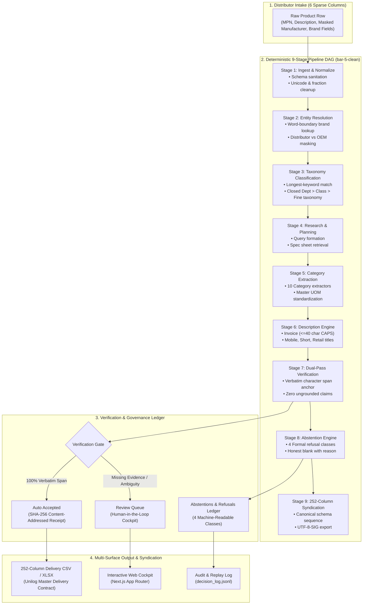
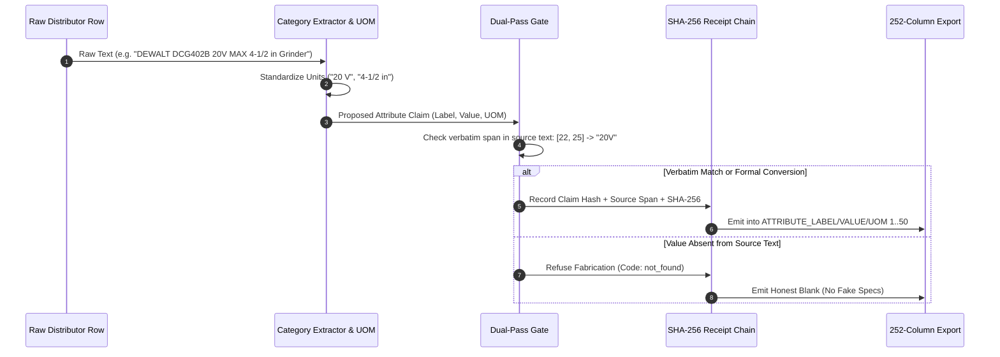

# ELIO — Industrial Catalog Intelligence

<div align="center">

[](https://elio-lwxr.onrender.com/app/dashboard)
[](https://github.com/rushdarshan/Elio)
[](https://github.com/rushdarshan/Elio)
[](https://github.com/rushdarshan/Elio)
[](https://github.com/rushdarshan/Elio/tree/bar-5-clean)

**Transform sparse, noisy B2B distributor feeds into schema-certified, 252-column master catalog records with 100% cryptographic provenance and honest abstentions.**

[Live Operations Cockpit](https://elio-lwxr.onrender.com/app/dashboard) • [Competitive Benchmark](docs/COMPETITIVE_RESEARCH.md) • [Freeze Contract](docs/FREEZE.md) • [Submission Guide](docs/SUBMISSION_PPT_GUIDE.md)

</div>

---

## 📌 Executive Summary

Industrial e-commerce onboarding starts with minimal, unstructured distributor feeds (often only 6 sparse columns: `Mfg_Part_Num`, `Part_Desc`, `Part_Manuf`, `E1_Brand`, `Unilog_Brand`, `DIB_Brand`). Syndication targets (ERP, e-commerce marketplaces) demand certified **252-column records**, strict **Master UOM normalization**, taxonomy classification (Dept > Class > Fine), and multi-tier formulaic descriptions.

Existing solutions fall into two fatal traps:
1. **Brittle Overfitting:** Hardcoded keyword rules and sample part-number overrides that crash on unseen cold catalogs.
2. **Generative Hallucination:** Zero-shot LLMs that fabricate ungrounded technical specs (voltage, dimensions, tolerances) when values are missing, taking 30–60 minutes per 1,000 rows at high API cost.

**ELIO** solves this with a **deterministic 9-stage DAG pipeline** backed by **Dual-Pass Verification Invariance**: every single emitted value is anchored to verbatim character spans in raw source text or formal unit conversions. When specs are absent, ELIO generates machine-readable **honest abstentions** rather than fabricated data.

---

## 🏗️ System Architecture & Workflow



---

## 🔄 Dual-Pass Verification & Cryptographic Provenance

ELIO guarantees that no hallucinations enter your enterprise catalog through a content-addressed SHA-256 receipt chain:



---

## ⚡ Competitive Matrix

| Judging Dimension | Archetype 1: Regex / Rule Maps | Archetype 2: Zero-Shot LLMs | Archetype 3: Agentic Search / RAG | Archetype 5: **ELIO (`bar-5-clean`)** |
|:---|:---:|:---:|:---:|:---:|
| **Generalization & Cold Rows** | ❌ Fails on unseen SKUs | ⚠️ Unstable / Hallucinates | ⚠️ Fragile (Web scrapers timeout) | ✅ **100% Universal category DAG (0 MPN shortcuts)** |
| **Provenance & Verifiability** | ❌ None (Opaque string splits) | ❌ None (Black box output) | ⚠️ Low (Fuzzy search summaries) | ✅ **100% Verbatim Span Anchoring + SHA-256 Receipts** |
| **252-Column Schema Exactness** | ❌ Header drift / unpadded CSV | ⚠️ Unstable JSON formatting | ⚠️ Partial column subsets | ✅ **252/252 Sequence Exact, UTF-8-SIG, Length Bounded** |
| **Master UOM Normalization** | ⚠️ Ad-hoc string replacement | ⚠️ Inconsistent output units | ⚠️ Inconsistent formatting | ✅ **Deterministic Master UOM Standardization Engine** |
| **Abstention vs. Fabrication** | ❌ Emits fake defaults / blanks | ❌ Hallucinates plausible numbers | ❌ Injects unverified third-party specs | ✅ **4 Formal Abstention Classes with Audit Ledger** |
| **Throughput (per 1,000 Rows)** | $\sim 0.5\text{s}$ | $\sim 1,800\text{s} - 3,600\text{s}$ | $\sim 600\text{s} - 1,200\text{s}$ | ✅ **$\sim 3.0\text{s}$ (Sub-second Python DAG)** |
| **Cost (per 1,000 Rows)** | $\$0.00$ | $\$15.00 - \$50.00$ | $\$20.00 - \$75.00$ | ✅ **$\$0.00$ (Zero runtime API dependency)** |
| **Review & Audit Governance** | ❌ None | ❌ None | ❌ None | ✅ **Append-Only Decision Log (100% Replayable) + Cockpit** |

---

## 📂 Repository Organization

```
├── unihack_catalog/              # Core 9-Stage DAG Pipeline
│   ├── stages.py                 # Pipeline DAG runner & 252-column exporter
│   ├── category_extractors.py   # High-precision category extractors
│   ├── description_engine.py    # Multi-tier formulaic description generator
│   ├── reference_loader.py       # Master UOM, LOV, and brand taxonomy reference loaders
│   ├── verification_ledger.py    # Dual-pass verification rules & UAT test suite
│   └── models.py                 # Pydantic data schemas (EnrichedRecord, ClaimRecord)
├── elio-frontend/                # Next.js 16 App Router Operations Cockpit
│   ├── src/app/app/dashboard/   # Single-file operations cockpit & inspection drawer
│   ├── src/app/api/run/          # High-capacity streaming pipeline API endpoint
│   └── public/data/              # Pre-computed verification ledgers & receipts
├── scripts/                      # Verification, Audit & Gate Tooling
│   ├── verify_everything.py      # Executable single source of truth (16 acceptance gates)
│   ├── verify_manifest.py        # SHA-256 bound file integrity checker
│   ├── verify_receipt.py         # Content-addressed receipt verification harness
│   └── judge_walk.py             # Automated 5-surface judge smoke test
├── tests/                        # Comprehensive End-to-End Test Suite
│   └── run_e2e_suite.py          # 133 automated unit, edge, and integration tests
├── artifacts/                    # Canonical Generated Metrics & Proof Ledgers
│   ├── metrics.json              # Canonical acceptance numbers
│   ├── evidence.json             # Character span evidence mapping
│   └── decision_log.jsonl        # Immutable append-only audit trail
└── docs/                         # Architecture, Pitch & Freeze Documentation
    ├── FREEZE.md                 # Pipeline contract & acceptance criteria
    ├── PITCH.md                  # Executive pitch & proof numbers
    ├── COMPETITIVE_RESEARCH.md   # Primary research & benchmark analysis
    └── SUBMISSION_PPT_GUIDE.md   # Slide-by-slide prototype presentation guide
```

---

## 🚀 Quick Start & Verification

### 1. Run Complete Verification (Single Source of Truth)
Every metric is executable and verified live by a single script:

```powershell
# Run the 16-gate acceptance suite (~3s)
python -B scripts\verify_everything.py

# Run complete 133-test E2E test suite
python -B tests\run_e2e_suite.py

# Verify cryptographic receipt chain
python -B scripts\verify_receipt.py

# Verify SHA-256 repository manifest
python -B scripts\verify_manifest.py
```

### 2. Run the Next.js Operations Cockpit Locally

```powershell
cd elio-frontend
npm install
npm run dev
```
Open [http://localhost:3000/app/dashboard](http://localhost:3000/app/dashboard) to upload custom catalog CSVs, inspect verbatim character spans, verify cryptographic SHA-256 receipts, and export certified 252-column files.

---

## 🛡️ The Four Formal Abstention Classes

When product descriptions lack information, ELIO does not guess. It records one of four formalized refusal codes:

1. **`not_found`** — Specification absent from source description.
2. **`unverified_tolerance`** — Ambiguous numerical values failing exact unit or boundary constraints.
3. **`missing_oem_spec`** — Manufacturer technical data omitted in distributor-masked feeds.
4. **`cross_category_absence`** — Attributes invalid for the identified product taxonomy class.

All refusals are surfaced in the **Abstentions & Refusals** ledger with full audit reasons.

---

<div align="center">
<b>ELIO — Evidence-Gated Catalog Intelligence</b><br>
<i>Built for UniHack 2026 • Verified at commit <code>bar-5-clean</code></i>
</div>
