# UniHack Catalog Intelligence Pipeline (win-features integrated)

## Overview

Greenfield build of the UniHack catalog intelligence pipeline defined in the locked PRD (docs/lite-prd/unihack-catalog-pipeline/lite-prd.md), integrated with the 7 ideation survivors ranked in the requirements doc. The build's spine is the PRD's 9-stage plain-Python DAG + Streamlit demo app; the win-features layer makes the accuracy claim an observable artifact: a live self-scoring harness over evidence-backed values (custody chains), a self-built frozen gold set, structural (query-answerer + dual-source) extraction, and judge-upload defenses. Execution is tiered M-first over a 4-day critical path ending Aug 23 23:59 IST.

---

## Problem Frame

Solo builder, ~4 build days, judged on innovation/accuracy/quality/scalability (accuracy largest share, ~40%). Accuracy is currently asserted, not observable; the gold set is missing; the sample input has zero rows in the deep categories; 3 public competitor repos target the same hackathon. The pipeline must let a judge reproduce the accuracy claim on their own upload in 30 seconds (see origin: docs/brainstorms/2026-08-19-unihack-win-features-requirements.md).

---

## Requirements Trace

- R1. Live evidence-support rate + abstention coverage on every run
- R2. Gold-overlap exact match rate when overlap exists; "estimate" label otherwise
- R3. Same scoring code path offline and in demo
- R4. 1%/2%/5% error-budget curve + per-row verified-vs-blank coverage bar
- R5. Dashboard gains evidence-support rate + abstention coverage (7 metrics total)
- R6. Score cells and enriched values clickable → custody chain
- R7. Per-value custody chain: search result → page → content hash → region/span → snippet
- R8. Field changelog with reasons, git-style, replayable
- R9. No value emitted without an evidence span (abstain)
- R10. LLM as query-answerer; deterministic pipeline poses questions; rules validate spans
- R11. Flight-critical fields (brand/MPN/dims/pack-count) need two independent sources; single-source held/escalated
- R12. Evidence repair folds into LOV repair ladder (generate → validate → repair → cap 2-3 → abstain)
- R13. Alias-conflict detector; `-- Unbranded --`/`-- No Unilog Brand --`/`-- No DIB Brand --` never brand-inferred
- R14. 100-row gold set (50 Faucets / 50 Fittings) from manufacturer-published SKUs, double-labeled on hard rows, frozen before tuning
- R15. Labeling methodology published
- R16. Unilog's 200-item file (if it arrives) audits the same harness
- R17. Column-mapping confidence; ambiguous mappings refused with manual fallback
- R18. Schema dry-run vs 252-col contract before enrichment
- R19. (Could) Pre-crawled content-hashed manufacturer evidence index as primary path

Plus PRD baseline (see origin: docs/lite-prd/unihack-catalog-pipeline/lite-prd.md): 9 stages end-to-end for every row; Faucets+Fittings field accuracy ≥85% (stretch 90%); ≥1 predictable escalation to review; 5 locked dashboard metrics + 2 new (R5); 50-row cap; free-tier host; no hard-coded outputs.

**Origin actors:** A1 (Judge), A2 (Solo builder), A3 (Catalog-ops persona)
**Origin flows:** F1 (Judge upload → run), F2 (Spot-check audit), F3 (Flight-critical uncertainty), F4 (Gold-set audit)
**Origin acceptance examples:** AE1 (covers R1,R3,R5), AE2 (covers R2), AE3 (covers R11), AE4 (covers R17,R18), AE5 (covers R10,R12)

---

## Scope Boundaries

- No dedicated cross-field evidence-repair loop (repair lives in LOV ladder, R12)
- No trust-propagation graph / page-rank source weighting
- No automation-ceiling page (PRD review panel stays; R4 curve is its summary view)
- No OCR (stub routing hook only, per PRD)
- No 252-column contract changes; no embeddings/Wikidata entity resolution
- R19 (pre-crawl KB) is droppable without touching any M requirement
- No LangGraph or heavy orchestration frameworks

### Deferred to Follow-Up Work

- Judge-runnable CLI: thin wrapper over the pipeline library; folded out of v1 scope unless the app demo fails to transfer
- Packaging deliverables (deck, demo video, README, GitHub repo init + push): separate workstream tracked outside this plan's units

---

## Context & Research

### Relevant Code and Patterns

- `scripts/check_reference_files.py` — existing stdlib-only script style: module-level constant, `Path(__file__)`-derived paths, exit codes (0/1). Mirror this convention for new scripts.
- `data/raw/README.txt` — drop folder contract for the 8 reference files (still all MISS; `scripts/check_reference_files.py` gates Day 1)
- `docs/lite-prd/unihack-catalog-pipeline/qa-log.md` — decision log behind the PRD (16 decisions)
- Sample input CSV: 6 cols, 1,000 rows, `-- Unbranded --` placeholder semantics; **0 genuine Faucets/Fittings rows** (category census in research)
- Expected output CSV: 252-col contract; groups: ATTRIBUTE_LABEL/VALUE/UOM ×50 each (150), ITEM_FEATURES ×20, Ref URL ×5 + MFR URL, 6 descriptions, 17 identity/classpath, 6 feature-ish singles, 9 identifiers/pricing, 10 dimensions (+UOM), 5 images, 20 documents, 3 misc

### Institutional Learnings

- None exist (docs/solutions/ absent — greenfield knowledge base). Capture post-hackathon via ce-compound.

### External References

- Cascade economics: FrugalGPT ~98% cost cut at matched quality; structural verification beats self-confidence gating; verifier ≤10-20% of next stage cost (generalcompute.com; llm-model-routing-benchmark lessons)
- LOV pattern: generate → validate → repair → cap 2-3 retries → fallback (iotdigitaltplm.com; aisecurityinpractice.com)
- Entity resolution: exact brand match (fuzzy brand = catastrophic FPs); alias table; RapidFuzz sub-second at 27k vocab (aversusb.net; WDC Products benchmark)
- HF Spaces free tier: 16GB RAM / 2 CPU / 50GB ephemeral; cold starts 30-90s; Streamlit SDK deprecated → Docker SDK; secrets via Settings; outbound 80/443/8080; cache dies on restart (huggingface.co/docs)
- Streamlit pitfalls: file_uploader persists across reruns (use on_change/processed flag); session-state write race #11415 (keep writes in callbacks); use st.form for heavy runs
- Competitors: CatalogIQ, product-enrichment-pipeline, UNI-Hack — none ship per-value provenance, LOV validation, cost tracking, or char-limit compliance

---

## Key Technical Decisions

- **Single library package + thin entry points**: the pipeline is a plain-Python library (`unihack_catalog`) with an offline CLI entry and the Streamlit app both importing it. One code path for scoring (R3), the app cannot drift from the eval.
- **Typed dataclass/Pydantic state, plain DAG** (PRD decision 10): stage functions take the record and return a new record; ordered stage registry + retry decorator + one review interrupt. No orchestration framework.
- **Evidence is a first-class object** (R7-R9): `(url, content_hash, page_region, snippet, fetched_at)` attached per attribute; a value without one is abstained at extraction, not repaired later.
- **Query-answerer contract** (R10): the deterministic layer poses narrow questions ("does page X state flow rate in L/min?"); the LLM returns JSON `{answer, evidence_span}`; rules validate span against LOV/UOM/char constraints before acceptance. Free-form enrichment output is not accepted anywhere.
- **Dual-source confirmation** (R11): for brand/MPN/dims/pack-count, two independent fetches (manufacturer product page + datasheet PDF/spec sheet) must agree; single-source → held for review panel.
- **Self-built gold set from manufacturer-published SKUs** (R14): the sample has zero deep-category rows, so gold rows come from real manufacturer spec sheets/datasheets for Faucets+Fittings SKUs. **Judged-population assumption stated: the organizer's 200 items are assumed to be deep-category (Faucets/Fittings) — if the sample's actual categories are judged instead, re-calibrate.** Frozen before tuning; double-labeled (two passes separated in time, diff-resolution rule pinned); methodology doc published; gold source docs published so the judge can re-derive labels. **CLI gold-set eval run: the pipeline runs over all gold rows to produce the headline exact rate — surfaced on the demo dashboard (gold audit = exact mode; judge upload = estimate mode).** Gold labels use U2's canonical brand vocabulary so overlap matching never under-reports on brand.
- **Scoring module shared offline/demo** (R3, R2): one `scoring.py` computes evidence-support rate, abstention coverage, error-budget curve, and (on MPN overlap) exact field match vs gold; demo labels it "estimate" when no overlap.
- **Judge-upload defense** (R17-R18): header normalization + per-column confidence from keyword/pattern match against the 6 known input columns and the 252-col contract; ambiguity → refusal + manual mapping UI; schema dry-run before any enrichment.
- **Cascade with hard budget** (PRD decision 5): deterministic rules → cheap hosted tier → paid model only on ambiguity/high-value fields; per-SKU LLM-call cap and cumulative run budget tracked in record.cost.
- **HF Spaces Docker SDK** (Streamlit SDK deprecated): Dockerfile from the Spaces Streamlit template; secrets via Space settings; warm-up beat scripted before judging; content-hashed disk cache rebuilt per session (ephemeral), with the R19 KB (if built) persisted as a repo artifact.

---

## Open Questions

### Resolved During Planning

- Gold-set row sourcing (origin deferred): sample has 0 Faucets/Fittings rows → gold rows come from manufacturer-published SKUs, labels from official spec sheets/datasheets
- Flight-critical field list: brand, MPN, dimensions (L×W×H + weight), pack count — matches PRD stage 7 dual-pass field set, now enforced at extraction via dual-source
- R19 scope bound: deep categories + top manufacturers only (from sample census: Freud/Diablo, Moen/Delta/Kohler/Blanco etc. — manufacturer list finalized during U6/U7 against the brand vocab)

### Deferred to Implementation

- [Technical] Exact LLM provider/model choice and API wiring for the cascade stages (cheap hosted vs paid); finalized when reference files and API keys are available
- [Technical] RapidFuzz scorer thresholds for alias matching (calibrated against gold set during U3)
- [Needs research] Whether the 8 reference files arrive (Unilog Resources tab); if they do, LOV/UOM vocab and char limits replace hand-built approximations, and R16 audit mode activates
- [Technical] Exact char-limit values for the 6 description variants (from UNILOG_INTERNAL_CONTENT_GUIDELINES.docx when available; hand-built defaults otherwise)

---

## Output Structure

    unihack_catalog/
      __init__.py
      config.py            # paths, model routing, budgets, char limits
      models.py            # Record, Identity, Classpath, Attribute, Evidence, Quality, Cost
      ingest.py            # CSV/XLSX intake, header contract, normalization (stage 1)
      resolve.py           # entity resolution: alias+RapidFuzz+vocab, conflict guard (stage 2)
      classify.py          # taxonomy over LOV-built index (stage 3) — OWNED BY U2 (resolve); U2 also builds data/vocab/lov/*.csv
      research.py          # allowlist, plan queries (stage 4)
      fetch.py             # content-hashed cache-first fetch, live fallback (stage 5)
      extract.py           # query-answerer extraction + LOV/evidence repair (stage 6)
      verify.py            # dual-source flight-critical, dual-pass, bands (stage 7)
      describe.py          # 6 description variants, char-limit tests, repair ladder (stage 8) — OWNED BY U5 (extract); the repair ladder is U5's R12
      export.py            # JSON + 252-col CSV projection (stage 9) — OWNED BY U1 (header-contract projection) + U9 download panel; formula-injection sanitization at write
      scoring.py           # evidence-support, abstention, error-budget curve, gold overlap
      dag.py               # ordered stage registry, retry decorator, review interrupt
      cli.py               # offline run/eval entry point
    app/
      app.py               # Streamlit entry: 6 panels + dashboard (8 metrics)
      panels.py            # upload/resolve/research/enrich/review/export panel logic
    data/
      gold/gold_set.csv, gold/methodology.md
      vocab/brands.csv, vocab/aliases.csv, vocab/lov/*.csv
      cache/               # content-hashed fetch cache (ephemeral, per-session)
    tests/
      test_ingest.py, test_resolve.py, test_scoring.py, test_extract.py,
      test_verify.py, test_export.py, test_dag.py, test_app_flows.py
    scripts/
      check_reference_files.py   # exists — keep
      build_gold_set.py          # labeling scaffold + validation
      prewarm_kb.py              # R19 crawl (Could tier)
    deploy/
      Dockerfile, README.md
    pyproject.toml

---

## High-Level Technical Design

> *This illustrates the intended approach and is directional guidance for review, not implementation specification. The implementing agent should treat it as context, not code to reproduce.*

```mermaid
flowchart LR
    UPLOAD[Upload + mapping confidence + schema dry-run] --> INTAKE[Stage 1: intake/normalize]
    INTAKE --> RESOLVE[Stage 2: entity resolution alias+RapidFuzz+conflict guard]
    RESOLVE --> CLASSIFY[Stage 3: taxonomy over LOV index]
    CLASSIFY --> PLAN[Stage 4: research planning allowlist]
    PLAN --> FETCH[Stage 5: content-hashed cache-first fetch]
    FETCH --> EXTRACT[Stage 6: query-answerer + LOV/evidence repair]
    EXTRACT --> VERIFY[Stage 7: dual-source flight-critical + bands]
    VERIFY --> DESCRIBE[Stage 8: description variants + char-limit tests]
    DESCRIBE --> EXPORT[Stage 9: JSON + 252-col CSV]
    VERIFY -->|held| REVIEW[Review panel]
    REVIEW -->|accept/reject per field| EXPORT
    EXPORT --> SCORE[scoring.py: evidence-support + abstention + curve + gold overlap]
    SCORE --> DASH[Dashboard: 8 metrics + custody drill-down]
```

Every value flowing EXTRACT → VERIFY → EXPORT carries an Evidence object; SCORE counts values with evidence spans vs abstained slots. Dual-source confirmation sits inside VERIFY for the 4 flight-critical fields only.

---

## Implementation Units

### Phase 1 — Foundation (Day 1)

**Unit tiers (droppable map): U1 M, U2 M, U3 M (scoring.py first, labeling split across Days 1-2) | U4 M, U5 M, U6 M | U7 M (R19 = Could), U8 M | U9 M — droppable parts of U9: dashboard polish and optional panel flourishes (Research timeline detail view, Export preview styling); the upload → run → review → export core is never droppable. S/C content sits inside units: R19 (Could), R16 (conditional), gold-set 200-row extension (gated).**

- U1. **Project skeleton + core data model**

**Goal:** Runnable package with the Record model, CSV intake (input + 252-col contract), config, and test harness — the base every other unit imports.

**Requirements:** PRD data model, R18 (contract), R13 (placeholder semantics)

**Dependencies:** None

**Files:**
- Create: `pyproject.toml`, `unihack_catalog/__init__.py`, `unihack_catalog/config.py`, `unihack_catalog/models.py`, `unihack_catalog/ingest.py`, `tests/test_ingest.py`, `tests/test_dag.py` (registry stub)
- Modify: `data/raw/README.txt` (unchanged contract; note gold-set plan)

**Approach:**
- Pydantic records: `input`, `identity` (brand/manufacturer separate edges), `classpath`, `attributes[]` (label/value/uom + evidence + confidence + verification status), `descriptions`, `quality`, `cost` — per PRD lines 35-52
- Ingest normalizes the 6 input columns; `-- Unbranded --` / `-- No Unilog Brand --` / `-- No DIB Brand --` map to explicit "no brand" tokens, never empty strings
- Header contract module: parse the 252-col expected-output header into named groups (from research census) — the export projection and schema dry-run both consume it
- **Header-contract module owns the external 252-col label set**; internal attribute labels (U5 question bank) are aliases of it — export is a pure projection with a completeness rule: every internal attribute maps to a column or is dropped with an explicit reason, never silently (prevents output-side silent corruption)
- Verification status enum on Attribute: `supported | contradicted | not_found | held` — `held` is single-source flight-critical (R11), exported blank until accepted; `review_outcome` field (accepted|rejected) records judge decisions separately — status and outcome are never conflated

**Patterns to follow:** `scripts/check_reference_files.py` stdlib-only script style for scripts; no new framework beyond pydantic + rapidfuzz + streamlit + pypdf (locked deps — pypdf required by U6's datasheet extraction; PDF parsing is a hard dependency of R11, not optional)

**Test scenarios:**
- Happy path: parse the 1,000-row sample CSV → 1,000 records, 6 fields each, no exceptions
- Happy path: parse the 252-col header → group counts match census (150 attribute triples, 20 features, 6 descs, etc.)
- Edge case: row with all placeholder brands → identity records "no brand" tokens, not text-match failures
- Edge case: empty file, BOM, CRLF line endings, quoted commas in Part_Desc → parsed without data loss
- Error path: malformed row (wrong column count) → row-level error isolated, run continues
- Integration: a Record round-trips through ingest → export projection → 252-col CSV without loss

**Verification:** `pytest tests/test_ingest.py tests/test_dag.py` green; sample CSV parses; header contract groups match the census; `scripts/check_reference_files.py` still exits 1 (expected until files arrive) with the run documented as gold-set-gated.

- U2. **Entity resolution (Stage 2) + conflict guards**

**Goal:** Brand/manufacturer resolution via alias table → RapidFuzz → vocab, with separate typed edges, alias-conflict detection, and placeholder guards.

**Requirements:** R13, PRD stage 2

**Dependencies:** U1

**Files:**
- Create: `unihack_catalog/resolve.py`, `data/vocab/aliases.csv`, `data/vocab/brands.csv`, `tests/test_resolve.py`
- Modify: `unihack_catalog/dag.py` (register stage)

**Approach:**
- Exact brand match first (fuzzy brand matching is catastrophic-FP territory — external research); alias table for observed `Part_Manuf` values (76 observed per PRD); RapidFuzz on remaining against the ~27k vocab
- Separate `brand_of` / `manufactured_by` edges; no merge without evidence (PRD decision 6)
- Alias-conflict detector: an alias mapping to 2+ distinct brands → flag in record.quality.review_reasons, never silently pick a winner (R13)
- Decision trail: match scores + chosen edge + rejected alternatives logged per record (feeds F2 changelog and audit)

**Patterns to follow:** PRD stage 2 spec; external entity-resolution lessons (exact brand, manual alias table, decision trail)

**Test scenarios:**
- Happy path: `Freud Inc (2435)` → manufactured_by=Freud Inc, alias resolved via table
- Happy path: fuzzy match on near-miss manufacturer string → top-1 from vocab with score recorded
- Edge case: `-- Unbranded --` input → brand edge = "none", no inference attempted (R13)
- Edge case: alias present in 2 brands' rows → conflict flag raised, no silent pick
- Error path: manufacturer string matches nothing (score below threshold) → abstained identity, review flag, pipeline continues
- Integration: resolved identity feeds classify stage (U3 dependency in DAG ordering) without error

**Verification:** resolve unit tests green; on the 1,000-row sample, every row resolves to an edge or an explicit abstention — no unresolved-but-silent rows; conflict flags appear for known ambiguous aliases.

- U3. **Frozen gold set + shared scoring module**

**Goal:** The 100-row gold set (50 Faucets / 50 Fittings) labeled from manufacturer-published spec sheets/datasheets, frozen; plus `scoring.py` — the single scoring code path used offline and live (R3).

**Requirements:** R2, R3, R14, R15, R16, PRD success criteria

**Dependencies:** U1, U2 (hard — gold labels must use U2's canonical brand vocabulary so MPN-overlap exact match doesn't under-report on brand). **Day-1 split: `scoring.py` first, gold labeling runs in parallel evening tracks (Day 1 evening → Day 2 evening, two passes ≥1 hour apart per R15); gold-slip gate: if the full 100-row set can't freeze by end of Day 2, freeze a minimum viable 50-row set with the caveat published in methodology.md and extend during U8 calibration**

**Files:**
- Create: `data/gold/gold_set.csv`, `data/gold/methodology.md`, `unihack_catalog/scoring.py`, `scripts/build_gold_set.py`, `tests/test_scoring.py`
- Modify: `unihack_catalog/config.py` (gold path, frozen flag)

**Approach:**
- Gold rows: manufacturer-published Faucets/Fittings SKUs (Moen/Delta/Kohler/Blanco/Chicago Faucets + fitting brands from the brand vocab), labels from official spec sheets/datasheets; 50/50 split; hard rows double-labeled with the resolution rule documented (R15)
- Solo-builder double-label procedure (R15): two labeling passes separated in time (≥1 hour, different order), diff resolution rule pinned (pass 2 wins on evidence, tie → abstain/re-check doc), published in methodology.md — the credibility package is hollow without a defined procedure
- `scoring.py` owns the run-level metrics dict shape (fields fixed here, consumed by U7/U9): evidence-support (over enriched slots), abstention coverage (**pipeline abstentions only** — never judge rejections), judge_disagreement (separate), curve inputs, gold overlap, decision mix (auto_accept/review/reject counts per PRD — the sole definition; verification statuses feed band assignment, review outcomes feed accept/reject); scoring is a pure function of the record set, **recomputed on any review decision** (cheap counting, same code path, R3 preserved)
- Freeze before tuning (R14): gold file gets a content hash in config; any change invalidates reported numbers
- `scoring.py`: evidence-support rate (values with evidence spans / enriched slots), abstention coverage (un-enriched slots / total slots), exact + normalized field accuracy vs gold on MPN overlap (R2), 1%/2%/5% error-budget curve (R4), char-limit compliance. Demo calls the same functions (R3)
- `scripts/build_gold_set.py`: labeling scaffold — takes SKU list, emits row template with label source fields (url, doc, page, labeler), validates 50/50 + no-duplicate-MPN

**Patterns to follow:** benchmark spec in PRD research HTML (frozen set, exact+normalized accuracy, evidence-support rate, controlled-vocab rate, abstention coverage, p95 cost/latency, 10 published error cases, confusion matrix)

**Test scenarios:**
- Happy path: score a perfectly enriched record set → evidence-support 100%, abstention 0%
- Happy path: gold overlap on 12 rows → exact field match rate computed for those rows only (Covers AE2)
- Edge case: no overlap → "estimate" label flag set (Covers AE2)
- Edge case: MPN match but case/format differences → normalized key matching (upper, strip spaces/dashes)
- Error path: scoring against an unfrozen/edited gold file → hash check fails, score refused with clear error
- Integration: the same scoring call path used by CLI eval and the app dashboard stub (R3)

**Verification:** gold set hashes stable; scoring tests green; methodology doc written; `scripts/build_gold_set.py` validates the set (50/50, unique MPNs, all rows have source docs).

### Phase 2 — Trust & Evidence (Day 2)

- U4. **Evidence & custody model**

**Goal:** Evidence as a first-class object with content hashing, custody chains, and per-field changelog — the substrate for scoring and the drill-down UI.

**Requirements:** R6, R7, R8, R9

**Dependencies:** U1

**Files:**
- Create: `unihack_catalog/evidence.py`, `tests/test_evidence.py`
- Modify: `unihack_catalog/models.py` (Evidence, changelog on Attribute)

**Approach:**
- Evidence = `(url, content_hash, page_region, snippet, fetched_at, refetchable)`; content hash = sha256 of fetched body (or page region text for large docs)
- Custody chain is the ordered list of hops: search result → product page → linked datasheet → span; each hop carries its own evidence fields (R7)
- Changelog: every field write appends `(field, old, new, reason, evidence_id, stage)` — never overwrite without retaining prior value + reason (PRD research HTML: provenance requirement)
- Extraction rejects values without evidence spans at the boundary (R9) — this is enforced in extract (U5) and asserted in export (U9)

**Patterns to follow:** PRD research HTML provenance definition ("a source URL alone is not evidence")

**Test scenarios:**
- Happy path: evidence object round-trips with all 6 fields intact
- Happy path: two fetches of same URL → same content hash (dedupe)
- Edge case: snippet > threshold → truncated with span start/end retained
- Edge case: changelog on repeated writes → ordered history with reasons, old values retained (R8)
- Error path: value write without evidence → rejected by the evidence-boundary assertion (R9)
- Integration: custody chain renders from a resolved record as hop list (feeds F2 backend)

**Verification:** evidence tests green; a fabricated record with an evidence-less value fails the R9 assertion; changelog replay produces the exact write history.

- U5. **Trust Engine extraction (Stage 6 reframe) + LOV repair**

**Goal:** Query-answerer extraction: deterministic questions → LLM evidence spans → structural validation; LOV/evidence repair ladder; guard rails against overconfident-wrong cheap models.

**Requirements:** R9, R10, R12, PRD stages 6-7

**Dependencies:** U1, U4

**Files:**
- Create: `unihack_catalog/extract.py`, `tests/test_extract.py`
- Modify: `unihack_catalog/config.py` (model routing, per-SKU budget)

**Approach:**
- Question bank per field family: e.g., flow rate, finish, connection type → each maps to a narrow question template; LLM returns `{answer, evidence_span}`; rules validate span presence + LOV membership + UOM compat + char bounds before acceptance (R10)
- Structural validation is the gate (not model self-confidence): span must exist in fetched content (substring/position check), answer must be in LOV or pass type coercion
- Repair ladder (R12): generate → validate → repair with specific error → cap 2-3 retries → abstain (value stays missing, counted in abstention coverage)
- Cascade wiring: deterministic extractors first; **cheap hosted tier** for most questions (no on-Space model inference — 2 CPU/16GB free tier cannot run a local model); paid model only on ambiguity or flight-critical fields; per-SKU call budget enforced in record.cost
- **Routing contract pinned**: `route(question, field, record) -> tier` with explicit escalation triggers — LOV miss, span-present-but-unvalidated, or flight-critical field escalates; per-SKU call cap is a backstop, the router is the policy. **Re-route loop defined: cheap-tier answer → validate → escalate to paid on LOV miss/span failure, with each re-route counted against the per-SKU cap (no silent re-route loops). LLM failure split: transient (429/timeout — retry with backoff, N attempts, then continue) vs persistent (401/5xx/auth — degrade to deterministic-only for the run)**
- LLM failure contract (deferred to implementation for model choice, not for behavior): 401/429/timeout/5xx all route to deterministic-only mode — pattern/rule extraction from already-fetched content with evidence spans, higher abstention, run completes, dashboard labels the run "deterministic-only"; run-level circuit breaker prevents 50 rows × N retries on a dead key
- Stub routing hook for OCR (PRD decision 8) — routing exists, implementation out of scope

**Patterns to follow:** cascade economics external research (verifier ≤10-20% of next-stage cost); LOV repair pattern; PRD stage 6 spec (reject any value without evidence span)

**Test scenarios:**
- Happy path: page contains "2.2 GPM" → flow-rate question returns span + answer accepted (Covers AE5)
- Happy path: LOV violation → repair cycle fixes near-miss enum value on retry 1
- Edge case: span in page but answer wrong per LOV → repair → abstain after cap 3 (Covers AE5)
- Edge case: cheap model overconfident-wrong (span present, wrong value) → structural validation catches it, no acceptance
- Error path: LLM call fails/timeouts → deterministic fallback or abstain, row continues
- Integration: a record flows intake → resolve → extract with evidence attached to every accepted attribute; abstained slots visible in record.quality

**Verification:** extract tests green; every accepted attribute carries an Evidence object (R9); repair counts ≤3 with circuit breaker; per-SKU call budget never exceeded on the sample.

- U6. **Research & fetch (Stages 4-5): allowlist, cache-first content-hashed fetch**

**Goal:** Research planning with manufacturer-domain allowlist + marketplace rejection; content-hashed cache-first fetch with graceful live fallback.

**Requirements:** PRD stages 4-5; R7 substrate

**Dependencies:** U1, U2 (allowlist per resolved manufacturer), U4 (evidence capture)

**Files:**
- Create: `unihack_catalog/research.py`, `unihack_catalog/fetch.py`, `data/vocab/allowlist.csv`, `tests/test_fetch.py`
- Modify: `unihack_catalog/dag.py`

**Approach:**
- Allowlist: resolved manufacturer → official domains (from brand vocab/research); marketplaces (amazon, ebay, homedepot, lowes, walmart, etc.) hard-rejected at ingress (PRD decision 7)
- Fetch: **cache lookup by URL+hash first → live fetch on miss → abstain with reason on failure (never fabricate)**; no "cache fallback" branch — the cache is the first stop, not a fallback; warm-up populates it so demo runs are cache hits
- Search planning: MPN + family search scoped to allowlisted domains; query plan logged per record (feeds Research panel source timeline)
- **Per-field fetch plan**: research emits, per flight-critical field, the required document types (product page + datasheet PDF) so verify (U8) is a pure agreement checker that never triggers fetches
- **Fetch policy pinned**: connect/read timeouts, max retries with backoff, robots.txt/user-agent compliance, TLS verification on, redirect cap **with every redirect hop re-validated against the allowlist at host level (cross-domain redirects rejected — closes the SSRF bypass)**, non-80/443/8080 URLs rejected at ingress (not failed mid-fetch)
- **PDF text-extraction path for datasheets** (the second source in R11): pypdf text extraction with page-region spans; image-only PDFs (no text layer) → abstain with reason per the No-OCR boundary — never treated as a second source; without it every flight-critical field is single-source → held → review flood
- All fetched content flows into evidence capture (U4) — re-fetchable, hashed

**Patterns to follow:** PRD decision 7 (cache-first, graceful fallback); HF Spaces outbound-ports constraint (80/443/8080 only)

**Test scenarios:**
- Happy path: allowlisted URL fetch → content hashed, cached, evidence created
- Edge case: marketplace URL → rejected at ingress before any fetch
- Edge case: cache hit → zero network call (timeline marks cache)
- Error path: site blocks/timeout → cache fallback, else abstain with reason; run continues (F3-adjacent resilience)
- Error path: hash mismatch on cache file → cache invalidated, refetch
- Integration: fetched evidence flows into extract (U5) and shows in the Research panel source timeline

**Verification:** fetch tests green; on a scripted offline run, all rows complete with abstention reasons on unfetchable content — no hangs, no fabricated values.

### Phase 3 — Measurability (Day 3)

- U7. **Live Eval Harness + dashboard metrics (Could-tier: R19 pre-crawl)**

**Goal:** Wire `scoring.py` into the run lifecycle: evidence-support + abstention + error-budget curve computed per run; gold-overlap mode; (Could) pre-crawl manufacturer KB as primary source. **Depends on U8 (listed before U7 by design): curve inputs (verification statuses, calibrated band rates) land in U8 first — until calibration lands, the curve runs on provisional placeholders.**

**Requirements:** R1, R2, R4, R5; R19 (Could)

**Dependencies:** U3 (scoring), U4 (evidence), U6 (fetch), U8 (decision mix + error-budget curve consume verification statuses and calibrated band error rates; U8 runs first in Phase 3); R19 also depends on U6. **Gold-set eval run: CLI over all gold rows → headline exact rate (U3 scoring) surfaced on the demo dashboard — gold audit = exact mode, judge upload = estimate mode**

**Files:**
- Create: `unihack_catalog/metrics.py` (run-level aggregation), `scripts/prewarm_kb.py` (R19), `data/cache/kb_index.json` (R19), `tests/test_metrics.py`
- Modify: `unihack_catalog/scoring.py` (run-level API), `unihack_catalog/dag.py` (post-run hook)

**Approach:**
- Run-level metrics: aggregate per-record evidence-support and abstention into run-level rates; error-budget curve (1%/2%/5% — field-error budget → coverage achieved); char-limit compliance (from describe stage); per-SKU cost + cumulative (record.cost) (R1, R4, R5)
- Gold overlap: MPN-normalized intersection of upload vs gold set → exact field match rate for overlapping rows; absent overlap → "estimate" label (R2, Covers AE2)
- R19 (Could): `prewarm_kb.py` crawls allowlisted manufacturer domains for deep categories into a content-hashed index; primary lookup path with fetch fallback; droppable — gate: if Day 2 slipped, cut R19 without touching M units

**Patterns to follow:** PRD dashboard metric definitions; scoring module API (U3)

**Test scenarios:**
- Happy path: run of 30 rows → evidence-support, abstention, curve all computed; dashboard-ready dict (Covers AE1)
- Happy path: R19 index hit → value sourced from KB with chain-of-custody hops
- Edge case: 0 overlapping gold rows → estimate label (Covers AE2)
- Edge case: partial overlap (12/30) → exact rate scoped to those rows
- Error path: gold hash mismatch → metrics refuse to report gold-derived numbers
- Integration: metrics feed the dashboard stub (U9) and the CLI eval identically (R3)

**Verification:** metrics tests green; CLI eval and app stub produce identical numbers for the same input; R19 index build idempotent (re-run = same hashes).

- U8. **Verification stage (Stage 7): dual-source + bands + calibration**

**Goal:** Dual-source confirmation for flight-critical fields, acceptance bands, and calibration against the frozen gold set. **Ordered before U7 (U7's metrics consume U8's statuses and calibrated band rates).**

**Requirements:** R11; PRD stage 7 (R12 repair ladder lives in U5)

**Dependencies:** U3 (calibration target), U4, U5, U6 (fetch plan + fetched documents)

**Files:**
- Create: `unihack_catalog/verify.py`, `tests/test_verify.py`
- Modify: `unihack_catalog/dag.py`, `unihack_catalog/config.py` (band thresholds)

**Approach:**
- Flight-critical (brand, MPN, dims, pack count): two independent fetches (e.g., manufacturer product page + datasheet PDF) must agree; single-source → `held` status → review panel (R11, Covers AE3). **Independence criterion pinned**: distinct URLs + distinct content hashes + distinct document types (a datasheet linked from the product page is independent; the same page fetched twice is not). **Agreement semantics per field type: normalized equality for brand/MPN; unit-converted comparison with tolerance bands for dims (12.5" vs 12.50" agree); exact match for pack count. Independence claim scoped honestly: dual-source detects extraction errors, not publisher data errors (both sources are usually the manufacturer's own materials) — documented in methodology.md; where the allowlist permits, prefer a distributor spec page as the second source**
- **Calibration check (R15 credibility): U8 measures the held/abstention rate on the gold set and sets a coverage floor for flight-critical fields (e.g., ≥90% of flight-critical slots either verified or review-flagged); the accuracy cost of abstention is quantified and the coverage/precision operating point chosen explicitly — blanks on the gold set count as wrong in automated scoring, so the floor exists to keep the ≥85% bar reachable
- Review semantics pinned: `held` values export blank until accepted (the 252-col contract has no held flag); judge reject = value removed, recorded via a `review_outcome` field (accepted|rejected) on the Attribute — **rejections count as a separate `judge_disagreement` metric, never folded into abstention coverage** (abstention counts pipeline abstentions only, so judge clicks can't inflate the honesty metric); changelog entry records the judge's decision — the judge's own accept/reject appears in the custody chain; review flags raised by resolve (U2) and classify route to the same review panel (not only VERIFY → held)
- **Review timing pinned: post-run.** Run completes → review panel → export + scoring recompute. Scoring recomputes over the frozen record set only (no streaming review — avoids concurrent mutation of the record set; dashboard metrics are never partial)
- Other fields: single-pass + rule checks (LOV membership, UOM compat, span presence) — PRD decision 9
- Bands: auto_accept / review / reject thresholds calibrated against the gold set (U3) — freeze thresholds with the gold hash
- Dual-pass (PRD decision 9) retained for agreement checking on the 4 flight-critical fields within a source

**Patterns to follow:** PRD stage 7; risk-coverage framing (wrong brand merge costed worse than missed alias)

**Test scenarios:**
- Happy path: page + datasheet agree on MPN → accepted, both sources in chain (Covers AE3)
- Edge case: page only (no datasheet) → held, review flag, not accepted (Covers AE3)
- Edge case: two sources disagree → reject with both values + reasons in changelog
- Edge case: pack-count value absent → abstained, counted in abstention coverage
- Error path: verification stage raises on a single-source flight-critical value → held path, run continues
- Integration: held rows appear in review panel queue; accepted/rejected outcomes update decision mix metric

**Verification:** verify tests green; ≥1 sample-adjacent hard row predictably escalates (PRD success criterion); band thresholds frozen with gold hash.

### Phase 4 — Demo & Ship (Day 4)

- U9. **Streamlit app + deployment**

**Goal:** The 6-panel demo app with upload defense, custody drill-down, review panel, export, 8-metric dashboard; packaged and deployed to HF Spaces via Docker SDK.

**Requirements:** R1-R8, R17, R18, PRD demo app spec, all success criteria

**Dependencies:** U1-U8 (all). **Thin app shell (upload → run → dashboard stub) pulled forward to end of Day 2-3 so the judge flow is exercised for ~2 days, not built cold on Day 4; U9 then adds panels/polish on a working base**

**Files:**
- Create: `app/app.py`, `app/panels.py`, `deploy/Dockerfile`, `deploy/README.md`, `tests/test_app_flows.py`
- Modify: `pyproject.toml` (streamlit dep, docker entry)

**Approach:**
- Upload panel: `st.file_uploader` with `on_change` callback + processed flag in session state (avoids reprocess-on-rerun pitfall); **upload limits pinned: max 25MB, extension + magic-byte type check (CSV vs real XLSX), XLSX decompression ratio/count caps (zip-bomb defense), row cap enforced before full parse (streaming read)**; **row selection for the cap: deep-category-first stratified selection, not first-50 (the sample's first rows are shallow — first-50 would show the pipeline at its worst)**; column-mapping step with per-column confidence **matched against the 6 known input columns only (the 252-col contract belongs to the export dry-run R18, not input mapping)**; ambiguous → refusal + manual mapping UI (R17); schema dry-run vs 252-col contract before run (R18); input hash displayed (PRD)
- Panels: Resolve (entity graph), Research (source timeline: cache hit vs live vs fallback), Enrich (label/value/UOM + citation, clickable → custody drill-down, R6), Review (interactive accept/reject; held rows from R11 land here), Export (CSV/JSON download + dashboard). **Navigation = stepper/wizard matching the linear DAG flow (upload → run → review → export), not free tabs — the demo is a guided narrative. Running state: per-stage progress (9 stages), row counts, live-fetch indicator, completion banner + auto-advance to dashboard. Review panel interaction: held rows grouped by field, conflicting dual-source values side-by-side with their evidence hops, accept/reject per value, visible feedback that scoring recomputed, empty state when no rows are held. Labels: "deterministic-only" and "estimate" render as a persistent banner + metric footnotes with explanatory copy (abstention = engineered honesty narrative), never bare badges. Export: formula-injection sanitization — cells beginning with `= + - @` (and tab/CR) are prefix-stripped or quoted before CSV write. Empty states: pre-upload landing, review panel with zero held, dashboard before a run, export before a run — each with defined copy, no crash**
- Dashboard: 8 metrics — field accuracy vs gold (**full-gold-set eval run; estimate mode for judge uploads**), per-row verified-vs-blank coverage bar (R4), LOV %, char-limit %, per-SKU cost, decision mix, evidence-support rate, abstention coverage (R5); score cells clickable (R6, F2)
- Session-state discipline: all state writes in callbacks (Streamlit race #11415); heavy run behind `st.form`
- **Single-replica reality**: free tier runs one replica — a busy flag refuses a second upload during a run with a clear message; the operator drives the upload (no self-serve concurrent judging). **Access control: the Space deploys PRIVATE (judge granted access) — public URLs are an anonymous LLM-spend + busy-flag-squat surface; plus a global (account-level) paid-tier spend cap and per-IP upload throttle as defense-in-depth**
- Deploy: Docker SDK (Streamlit SDK deprecated), Dockerfile from Spaces Streamlit template; secrets (LLM keys) via Space settings; outbound-ports constraint honored (fetch only 80/443/8080)
- **Warm-up beat** (pre-judge checklist in deploy/README): health check + one canned 5-10 row run + **pre-fetch of the judge's actual file** — the operator receives the file before the demo and runs it once so its URLs populate the content-hashed cache; the judge's in-demo run is then cache hits and completes in the 30s window; the judge's file is never cold-fetched live (live fetch = longer "live run" mode, labeled as such, not the 30s promise); **re-runnable after any Space restart** (ephemeral cache wipes on restart, memory pressure, idle timeout); if R19 is built, the KB is the secondary path
- **Health endpoint**: reports mode (deterministic-only vs full), cache state, last-run status — the operator verifies before the judge arrives
- **Rollback**: push last-known-good tagged commit to the Space repo (rebuild ~minutes); maintain the tag from Day 3
- **Day-3-end decision gate**: if the Space deploy isn't green, build the judge-runnable CLI fallback (currently deferred) so the demo has a guaranteed path

**Patterns to follow:** HF Spaces Docker SDK docs; Streamlit pitfalls research; PRD panel spec

**Test scenarios:**
- Happy path: upload sample CSV (30 rows) → run completes → dashboard shows all 8 metrics (Covers AE1)
- Happy path: click an enriched value → custody chain modal renders (Covers F2)
- Edge case: renamed column → confidence shown; unmappable column → refusal + manual mapping (Covers AE4)
- Edge case: oversized file (>50 rows) → cap notice, first 50 processed (PRD)
- Edge case: empty file / all-placeholder rows → graceful empty-state, no crash
- Error path: LLM key missing → cascade degrades to deterministic-only, error surfaced in Research panel, run completes
- Error path: mid-run Space restart → progress state restores or run restarts cleanly (cold-start beat)
- Integration: export CSV column count == 252 and order matches contract (R18); gold-overlap mode renders exact rate when overlap present (Covers AE2)

**Verification:** app boots locally and on the Space; the full F1→F4 flows execute against a 30-row judge-style upload; export passes the 252-col contract check; deployment URL live and warm before judging.

---

## System-Wide Impact

- **Interaction graph:** Stage DAG (U1-U9) — each stage transforms the record; review interrupt is the single branch point; scoring is a pure function of the record set, recomputed on any review decision (never a stage, never stale)
- **Error propagation:** Per-row isolation — a failure in any stage abstains/reviews that row, never aborts the run; errors carry reason codes into quality.review_reasons and the changelog
- **State lifecycle risks:** Record state machine (input → resolved → enriched → verified → exported); partial writes prevented by immutable record transitions; cache invalidation via content hash; changelog never overwrites prior values
- **API surface parity:** The 252-col export contract is the parity surface — schema dry-run (R18) and export projection share the header-contract module (U1), so app, CLI, and eval cannot drift
- **Integration coverage:** End-to-end DAG test on 30 rows (app flow); gold-overlap scoring through the app (R2); review-panel accept/reject → export reflects decisions (F3)
- **Unchanged invariants:** PRD locked decisions (9 stages, 50-row cap, free tier, cascade, no hard-coding) hold; the 252-col contract is unchanged; new features add metrics/evidence, never alter the export schema

---

## Risks & Dependencies

| Risk | Mitigation |
|------|------------|
| LLM unavailable on demo day (no key / wrong key / quota / rate limit) | Pinned degradation contract: **transient (429/timeout) → retry with backoff, N attempts; persistent (401/5xx/auth) → deterministic-only mode** (rule extraction from fetched content, higher abstention, run completes, dashboard labels "deterministic-only"); run-level circuit breaker; no-key path rehearsed in warm-up; narrative pre-decided (abstention = engineered honesty) |
| **Accuracy below the 85% bar after U8 calibration** | **Decision rule triggered at U8: measure held/abstention + band error rates on the gold set; if the bar is missed, raise the abstention threshold and/or narrow categories (Faucets-only), re-freeze thresholds with the new gold hash, and adjust the demo narrative — rehearsed before demo day, never discovered on it** |
| Dual-source fails without PDF parsing | U6 fetch includes PDF text extraction; datasheet PDF is the required second document type in the per-field fetch plan |
| Live fetch fails during demo | Cache-first + warm-up beat populates the fetch cache with demo rows (re-runnable after restart); R19 KB as primary path if built |
| Reference files (LOV/UOM/guidelines) never arrive | Defaults with pinned sources: LOV seeded from observed sample values + gold-set spec sheets (U3); char limits from the 252-col contract + sample max lengths; frozen with the gold hash and published in methodology.md |
| LLM cost blowout | Deterministic-first cascade; explicit router (LOV miss / span-present-but-unvalidated / flight-critical escalates); per-SKU call budget; verifier ≤10-20% of next-stage cost discipline |
| HF Spaces cold start / ephemeral cache | Docker SDK; warm-up = health + canned run (cache population); single-replica busy flag; rollback = last-known-good tag push; Day-3 gate → CLI fallback |
| Over-scope (4-day solo) | M-first sequencing; S/C units droppable without touching M (U7 R19, U9 polish gated) |
| Sample has 0 deep-category rows | Gold set from manufacturer-published SKUs; demo uses judge upload + pre-warmed deep-category rows |
| Not a git repo (no versioning, no safety net) | Day 1: `git init` + `.gitignore` (secrets, `data/cache/`, `.env`) + pinned requirements lockfile; HF Space repo configured as the deploy remote — **push is a deploy prerequisite, not packaging**; tag last-known-good from Day 3 |

---

## Documentation / Operational Notes

- `data/gold/methodology.md` — the published labeling methodology (R15); part of the credibility package
- `deploy/README.md` — deployment, secrets setup, warm-up procedure for the judge demo
- Packaging deliverables (deck, video, README, GitHub push) are a separate workstream outside this plan's units

---

## Sources & References

- **Origin document:** [docs/brainstorms/2026-08-19-unihack-win-features-requirements.md](docs/brainstorms/2026-08-19-unihack-win-features-requirements.md)
- **Baseline PRD:** [docs/lite-prd/unihack-catalog-pipeline/lite-prd.md](docs/lite-prd/unihack-catalog-pipeline/lite-prd.md)
- **Ideation:** [docs/ideation/2026-08-19-unihack-win-ideation.md](docs/ideation/2026-08-19-unihack-win-ideation.md)
- **Research source:** [unihack_product_enrichment_research.html](unihack_product_enrichment_research.html)
- Related code: [scripts/check_reference_files.py](scripts/check_reference_files.py)
- External: HF Spaces docs (huggingface.co/docs/hub/en/spaces-overview), cascade economics (generalcompute.com), LOV validation patterns (iotdigitaltplm.com), entity resolution (aversusb.net), Streamlit session-state issues #7097/#11415